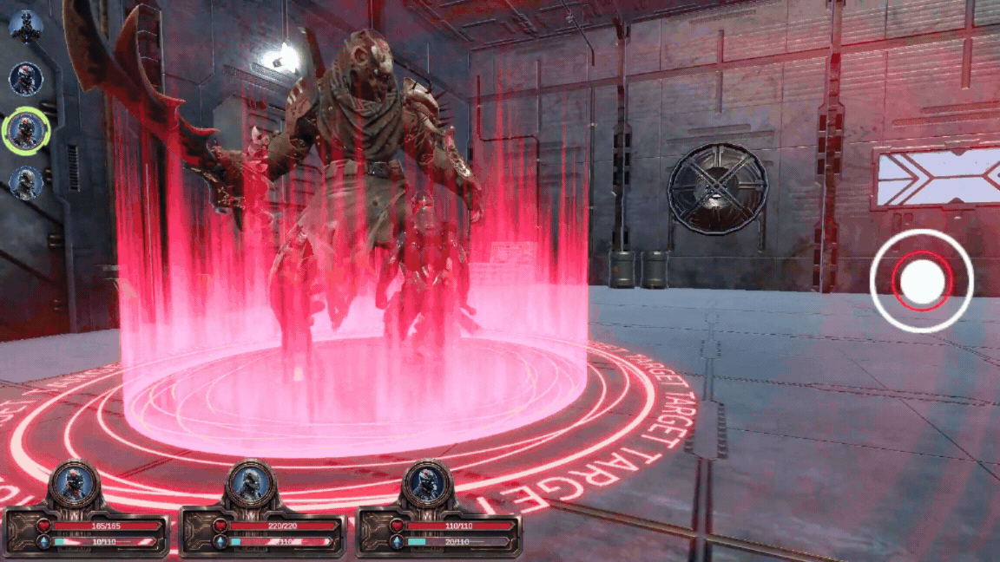
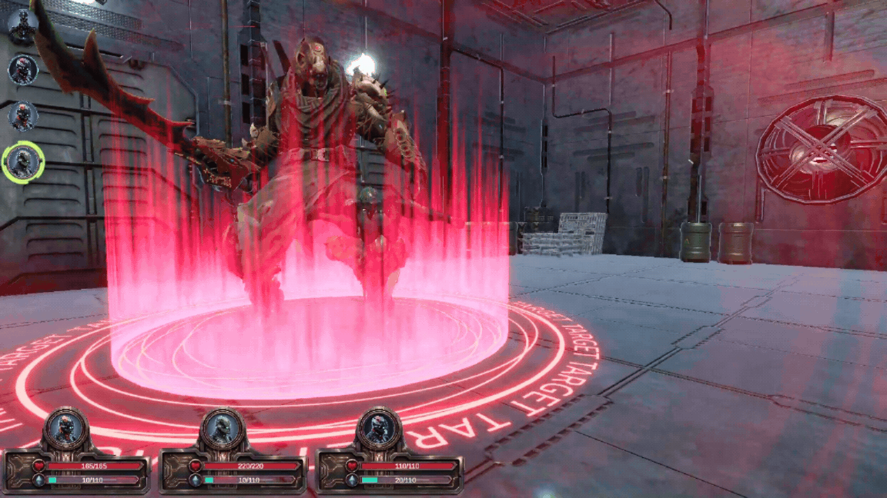
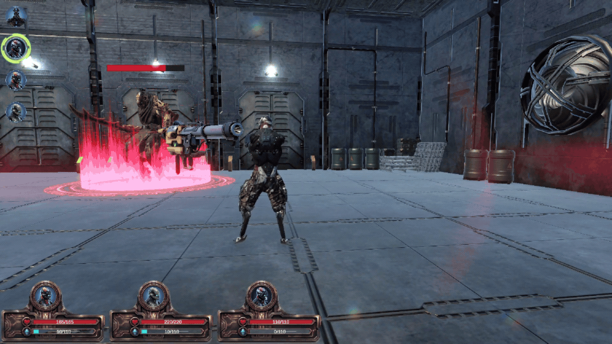

# Conquer The Stars

> **3D Turn-Based RPG for Android** — a solo Unity/C# portfolio project designed for landscape touchscreen play, with tactical combat and reusable gameplay systems.

## 🎮 Demo

[Download](https://pakbot4124.itch.io/conquer-the-stars) · [Gameplay Video](https://youtu.be/g3vkVFKuGm8) · [Developer Logs](https://app.notion.com/p/3-Week-Engineering-Polish-Sprint-25-09-15-10-2026-3e5fa5c6075a8168aa4ec2b897999959?source=copy_link)

<p align="center">
  
  
  
</p>

## 📖 Overview

Lead a team through turn-based encounters, choose skills and targets, manage consumables, and defeat bosses to earn EXP and strengthen your party. The project combines tactical action selection with defensive mechanics and persistent progression.

**Status:** In development — current focus: mobile UI, combat balancing, and boss polish.

## ⚔️ Key Systems

- **Combat** — Speed-based initial turn order, turn stealing, skill/target selection, defensive actions, and battle results.
- **Enemy AI & Bosses** — Weighted target evaluation using HP, threat, and defense; health-based boss phase changes.
- **Items & Buffs** — Healing, mana recovery, revival, and temporary stat buffs; quantity tracking and out-of-stock restrictions.
- **Progression** — Battle EXP rewards, multi-level advancement, and level-based character stats.
- **Save / Load** — JSON persistence for position, team level/EXP, item quantities, and completed battle IDs; New Game resets progression and restores defeated encounters.

## 🛠️ Technical Highlights

- **State Machines** — Separate battle-flow and actor state machines coordinate selection, execution, and results.
- **Data-Driven Design** — ScriptableObjects configure stats, attacks, items, enemy teams, rewards, and AI evaluation weights.
- **Reusable Systems** — Factory-based item effects and object pooling for actors, VFX, and UI, with event and state cleanup on reuse.
- **Android Profiling** — Tested on a real Android device; tuned render scale, shadows, and post-processing toward a stable 30 FPS target.

**Built with:** Unity **6000.3.8f1** · C# · URP · Input System · Cinemachine · Unity UI

## 🎯 Controls

**Android — landscape orientation**

| Action | Input |
|---|---|
| Move | On-screen movement control |
| Select actions, items, and targets | On-screen combat controls |
| Dodge | Swipe vertically on the right side of the screen |
| Block | Swipe vertically on the left side of the screen |

## 📂 Project Structure

```text
Assets/Scripts/
├── Fight/             # Battle setup, turn order, AI, and team management
├── Input/             # Exploration and combat input
├── Managers/          # Game flow, audio, and UI coordination
├── Pattern/           # State machines, object pooling, and item factory
├── Save/              # JSON persistence and save data
├── ScriptableObject/  # Gameplay configuration assets
├── Stats/             # Character stats and level scaling
├── UI/                # Menus, combat HUD, and item selection
└── VFX/               # Visual effects logic
```

## 🚀 Run Locally

1. Clone the repository and open it with **Unity 6000.3.8f1**.
2. Allow Unity to import assets and resolve packages.
3. Open `Assets/Scenes/Start.unity` and press **Play**.
4. Choose **New Game**, or **Continue** if a save exists.

## 👨‍💻 Developer & Credits

Developed by [Phạm Anh Khoa](https://github.com/khoaPA41). Portfolio focus: gameplay programming, system integration, and optimization. Third-party art, UI, audio, and VFX assets belong to their respective creators.

